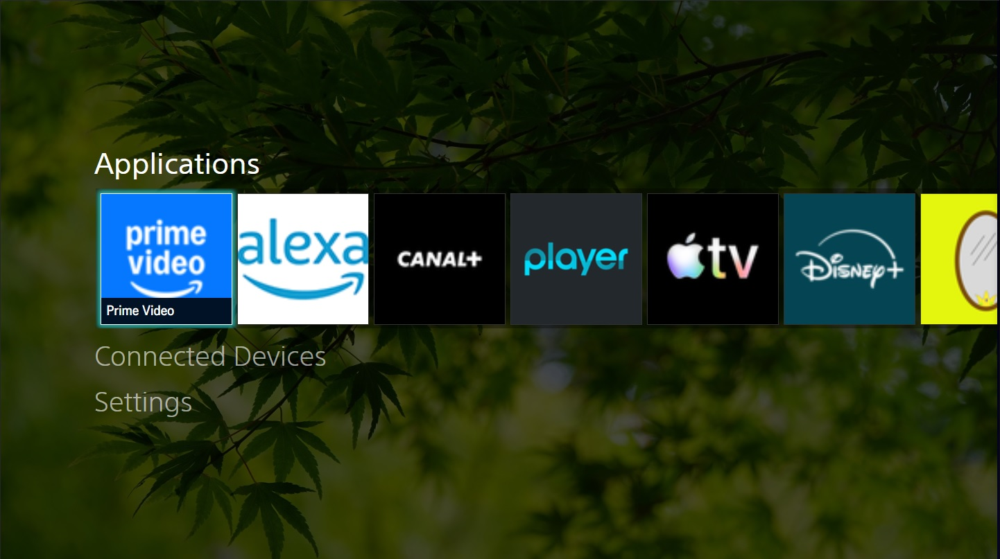

# Genome Launcher webOS
webOS custom launcher based on sony 2013 menu recreation (https://theubusu.xyz/sonymenu/), which ive now learned is codenamed "Genome"

This is not a final product and will probably never be

## Build
It requires homebrew channel and root to work.   
It is tested on webos 6 and webos 25.   
to build: `ares-package src`